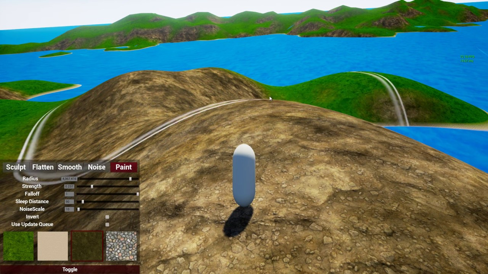

# TerrainEditor UE4
## Update Notice 2020/2021: 
This project came to an abrupt halt around the end of 2016 when I lost alot of uncommited progress due to multiple harddrive failures. Since then I was able to restore some of the functionality. The main difference between what is currently on github, is that the "terrain sections" (see terrainSection.cpp) were replaced with a clipmap based approach (see: https://developer.nvidia.com/gpugems/gpugems2/part-i-geometric-complexity/chapter-2-terrain-rendering-using-gpu-based-geometry) that allows the rendering of near infinite terrain. I planned to re-release this demo project as a reusable plugin, but couldn't be bothered to fix some of the projects architectural flaws yet. \

Also for the people asking me for the license terms, feel free to use it however you like. This demo will give you a good idea on how to implement a terrain that can be edited during runtime but be aware that it was **not** created by a professional (and by now it might already be possible to edit the real landscape component during runtime without editing UE4's source code).

### About
- A set of components that makes terrain manipulation from within the game possible.
- It does not use unreal engines own landscape component. Instead it generates a procedural mesh that acts as the terrain. 
- Made with C++. 
- API exposed via Blueprint. Just add the "SculptComponent" to your player character and hook up the minimal API.
- Works with the ProceduralMeshComponent and the RuntimeMeshComponent.

### Example
Click on the image to see it in action on youtube:

[Forum Thread](https://forums.unrealengine.com/community/work-in-progress/96841-ingame-terraineditor-with-source)

### Getting Started:
- Make sure you have the RuntimeMeshComponent installed
- Clone or Download this project
- Right click the uproject file, select "Generate Visual Studio project files"
- Open the generated sln file, build it.
- launch unreal engine 

### Credits:
- Chris Conway (Koderz) - for the [RuntimeMeshComponent](https://github.com/Koderz/UE4RuntimeMeshComponent)
- Afan Olovcic (DevDad) -  for the [SimplexNoise Plugin](https://github.com/devdad/SimplexNoise)
